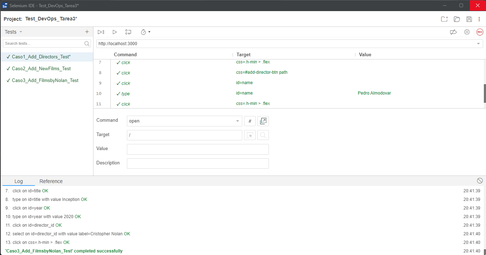
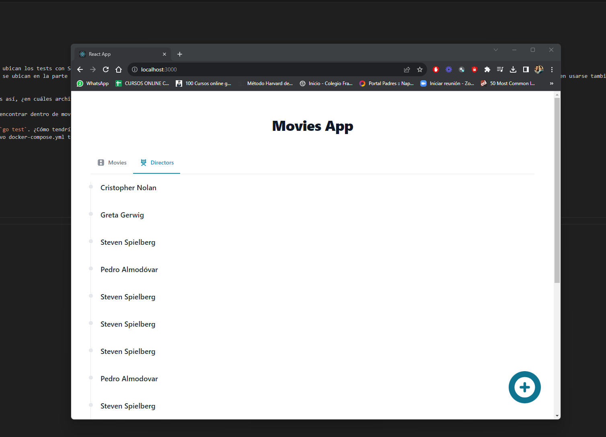
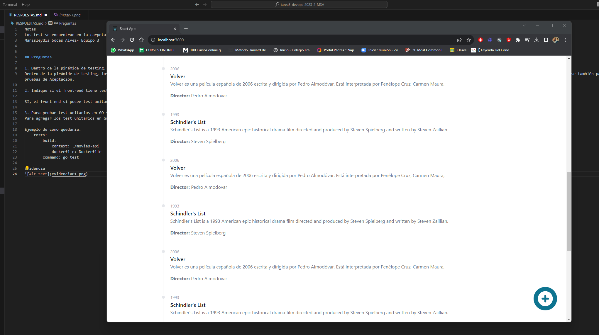
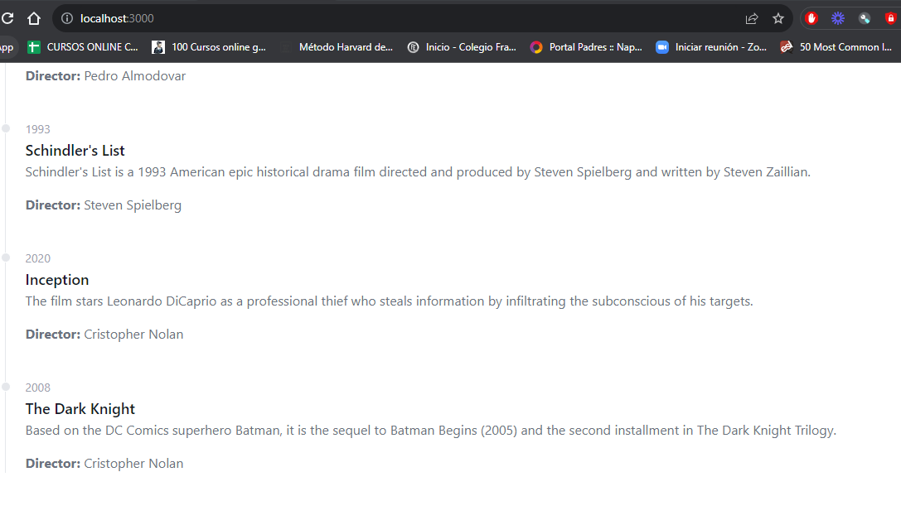

Notas

#Marisleydis Socas Alvez- Equipo 3
#Los test se encuentran en la carpeta TEST.

## Preguntas

1. Dentro de la pirámide de testing, ¿en que sector se ubican los tests con Selenium? ¿A cuál o cuáles tipos de test coresponde (regresión, integración, aceptación, etc).
Dentro de la pirámide de testing, los test de Selenium se ubican en la parte superior de la priramide de testing, ya que se enfoca en la Calidad Funcional, las pruebas que se ejecutan con Selenium cubren las pruebas de regresión y pueden usarse también para las pruebas de Aceptación.

2. Indique si el front-end tiene tests unitarios. Si es así, ¿en cuáles archivos se encuentran definidos?

SI, el front-end si posee test unitarios, los podemos encontrar dentro de movies-front, específicamente en las carpetas src/components/AddDirector.test.js y src/components/AddMovie.test.js

3. Para probar test unitarios en GO se usa el comando `go test`. ¿Cómo tendría que modificar el archivo `docker-compose` para correr los tests unitarios del backend?
Para agregar los test unitarios en Go dentro del archivo docker-compose.yml tendriamos que modificar la siguiente linea a "command: go test" para que cuando se levante el docker ejecute el comando indicado.

Ejemplo de como quedaria:
    tests:
        build:
            context: ./movies-api
            dockerfile: Dockerfile
        command: go test

Evidencia

